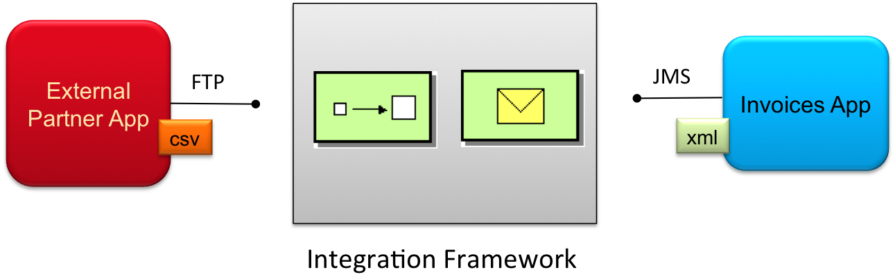

// Asciidoctor attributes

== JBoss Fuse Product Architecture

* A messaging platform is not enough when designing for complex architectural use cases.

.Integration Framework

  
* Data routing decisions should be handled by a specific integration technology or framework called a _mediation and routing engine_.

.JBoss Fuse Components

image::images/fuse-component-architecture.png[]

ifdef::audioscript[]
audio::audio/m01p04_jboss_fuse_product_architecture.mp3[]
endif::[]

ifdef::showscript[]
[.notes]
****
//tag::snippet[]

== TITLE

//end::snippet[]
****
endif::[]
