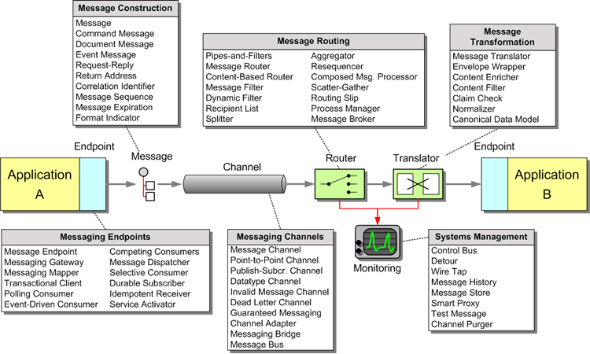

// Asciidoctor attributes

== Enterprise Integration Patterns in A-MQ & Fuse

	
image:images/eai-hohpe-woolf.png[“Book Front”,width=80,
link="/images/eai-hohpe-woolf.png”] *Enterprise Integration Patterns : Designing, Building, and Deploying Messaging Solutions* +
_Gregor Hohpe, Bobby Woolf_ +
ISBN 0321200683 +
Addison-Wesley, 2004

.Enterprise Integration Patterns

ifdef::audioscript[]
audio::audio/m01p05_enterprise_integration_patterns_in_amq_fuse.mp3[]
endif::[]

ifdef::showscript[]
[.notes]
****
//tag::snippet[]

== TITLE

//end::snippet[]
****
endif::[]
