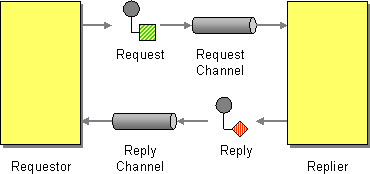

// Asciidoctor attributes

== Asynchronous Request-Reply Pattern

=== Request-Reply Communication:

* 2 way communication between applications

* Usually implemented in a _synchronous_ mode

* Examples: Web Services, Client-Server, HTTP Request/Reply, API calls

=== Sync/Async:

* 2 way conversation between discrete applications.

* Send a pair of Request-Reply messages, each on its own channel.

* Examples: Slow aggregations, human workflow, asynchronous processors

.Request Reply Pattern

ifdef::audioscript[]
audio::audio/m01p06_asynchronous_requestreply_pattern.mp3[]
endif::[]

ifdef::showscript[]
[.notes]
****
//tag::snippet[]

== TITLE

//end::snippet[]
****
endif::[]
